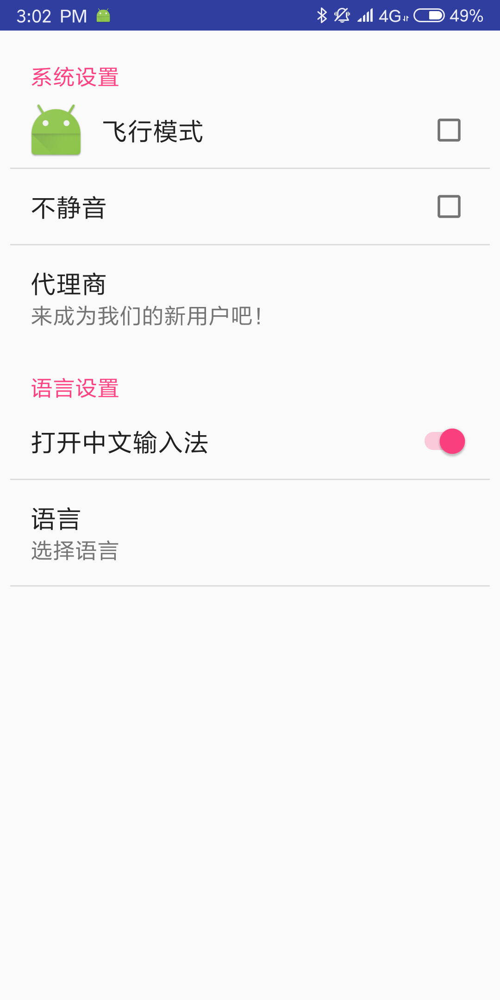
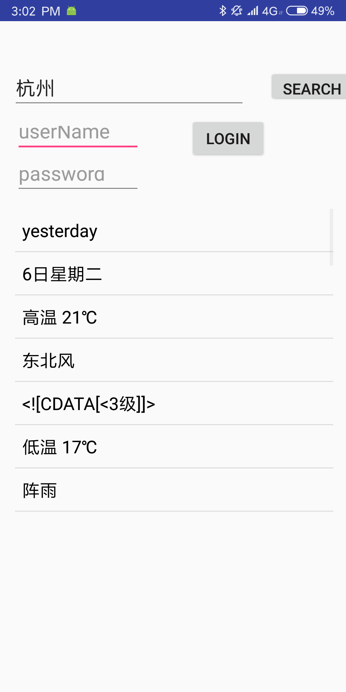

# 安卓课实验项目|Android development experiment
A course project about Android, involving several components such as the button, scroll view, activity, Service, Fragment and so on.
Also included some demos of BMI calculator, database query and insert, the weather forecast using API provided by www.weather.com.cn.

## preview

BMI calculator

 Setting view

Weather forecast

Chatting simulator

